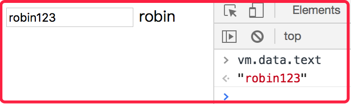
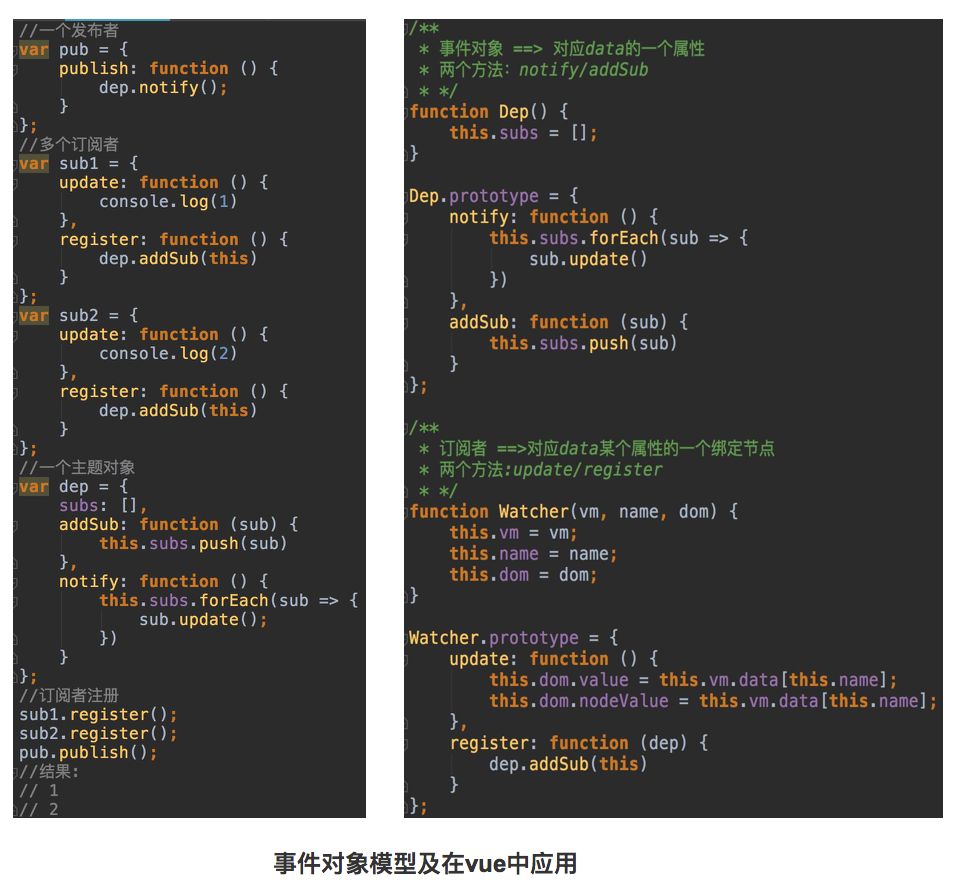
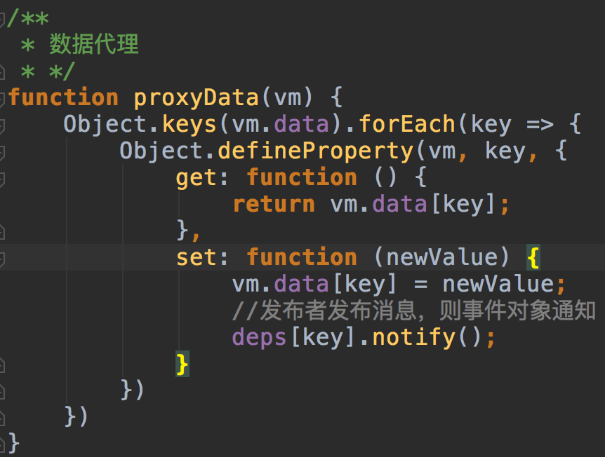
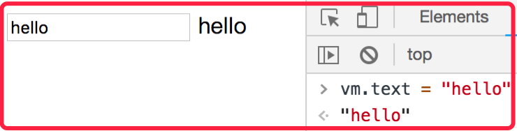
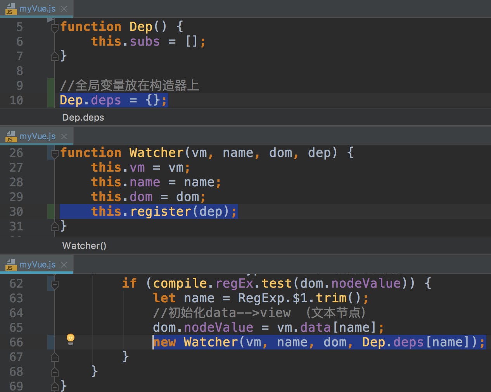
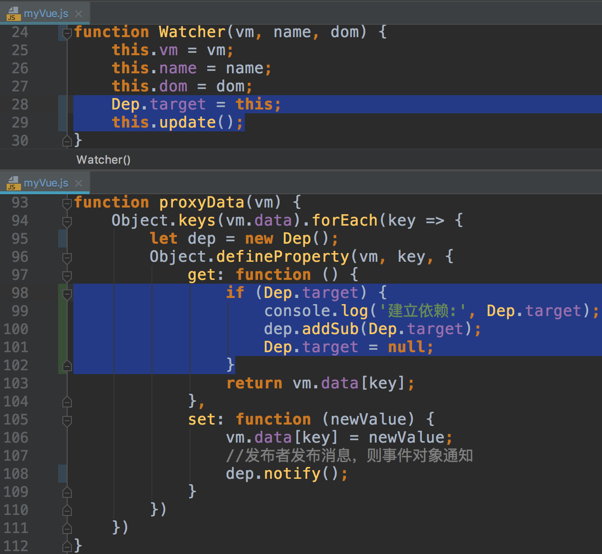
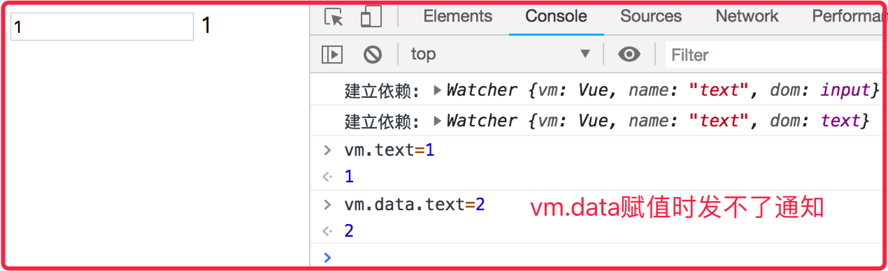

# vue源码由浅入深
### step1、简单双向数据绑定
+ 实现
    + 正向：Object.defineProperty接口的set特性
    + 反向：input事件
+ 缺点
    + 绑定过程和模版紧密耦合
+ 示例

### step2、双向绑定框架模型
+ 优点
    + 配置和模版交给用户，绑定过程交给框架
+ 示例

### step3、初始化数据绑定
+ 过程
    + 编译compile
        + 编译元素节点和文本节点
        + 文本节点使用正则表达式匹配{{}}符号
        + 注意innerText,value,nodeValue三者区别
    + dom劫持到DocumentFragment
        + appendChild是对dom节点进行剪切，配合firstChild则可以遍历
        + 递归遍历进行编译
    + vue构造函数
        + options选项数据作为vue对象数据
        + 将编译好的fragment挂载到根节点
+ 示例

### step4:视图到数据的动态绑定
+ 原理
    + input事件
        + 给拥有v-model属性的节点添加input事件监听
+ 示例

### step5:发布订阅模式
+ 三个角色
    + 发布者
        + 发布publish
    + 订阅者
        + 更新update
        + 注册register
    + 事件对象
        + 通知notify
        + 添加订阅者addSub
+ 示例

### step6：数据代理-set时发布通知
+ 过程
    + vm.text代理vm.data.text
    + 对vm.text修改时，调用pub.publish()
+ 核心API
    + Object.defineProperty()
+ 示例

### step7:数据到视图的动态绑定
+ 过程
    + 在数据代理时，每一个属性新建一个事件对象dep
    + 在编译节点时，每一个节点新建一个订阅者watcher，并注册
+ 示例

### step8:双向绑定的优化
+ 优化
    + 全局变量放在构造函数属性上
    + 订阅者实例化和注册在一起，可以把注册放在构造器内部
+ 示例

### step9:双向绑定的优化2
+ 优化
    + 注册就是收集订阅依赖，而在订阅者update更新时，会调用属性的get方法，这里面可以收集依赖，因此可以省略掉订阅者register方法。
    + Dep.deps全局变量只在数据代理中使用，可以转化为局部变量
+ 问题
    + 通知是通过vm数据代理的set回调发出的，所以对vm.data赋值时发不出通知
    + 数据监听只能监听原始类型，不可以监听对象类型
    + 选项中没有方法
    + 选项中没有生命周期钩子
+ 示例

