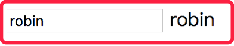

# vue源码由浅入深
### step1、简单双向数据绑定
+ 实现
    + 正向：Object.defineProperty接口的set特性
    + 反向：input事件
+ 缺点
    + 绑定过程和模版紧密耦合
+ 示例

### step2、双向绑定框架模型
+ 优点
    + 配置和模版交给用户，绑定过程交给框架
+ 示例

### step3、初始化数据绑定
+ 过程
    + 编译compile
        + 编译元素节点和文本节点
        + 文本节点使用正则表达式匹配{{}}符号
        + 注意innerText,value,nodeValue三者区别
    + dom劫持到DocumentFragment
        + appendChild是对dom节点进行剪切，配合firstChild则可以遍历
        + 递归遍历进行编译
    + vue构造函数
        + options选项数据作为vue对象数据
        + 将编译好的fragment挂载到根节点
+ 示例

